# **밀리루틴(MILIROUTINE) - 군생활 루틴 만들기**

<div align="center">
   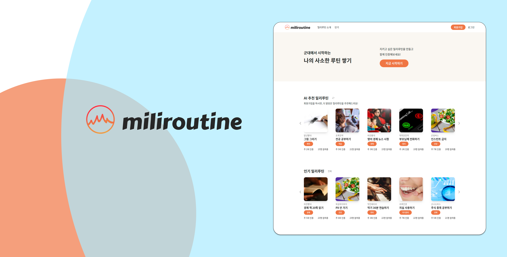
    <br>
    <br>
    <p>군대에서 시작하는 나의 사소한 루틴 쌓기.<br>지키고 싶은 밀리루틴을 만들고 함께 인증해보세요!<br><br>
        <a href="http://miliroutine.com"><big>miliroutine.com</big></a><br>
        <small>(2022년 11월 한 달만 서버를 열 예정입니다)</small>
    </p>
    <br>
    <div display="flex">
      <a href="assets/PPT.pdf">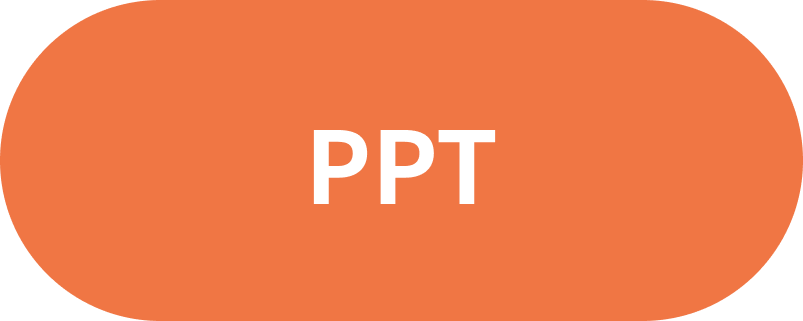</a>&nbsp;&nbsp;&nbsp;&nbsp;&nbsp;&nbsp;&nbsp;&nbsp;
      <a href="https://www.youtube.com/watch?v=h4L3SUrZ61s"></a>&nbsp;&nbsp;&nbsp;&nbsp;&nbsp;&nbsp;&nbsp;&nbsp;
      <a href="https://www.figma.com/community/file/1170373715075438188"></a>
    </div>
    <br>
</div>

## 💡 **Service Needs | 기획 의도**

군생활을 의미있게 보내려 노력하는 사람들이 정말 많습니다. `매일 헬스장 가기`, `자격증 공부하기` 등의 목표를 세우지만, 그저 자기자신과의 약속이기 때문에 종종 작심삼일에 그치곤 합니다.

군 바깥의 사람들과 함께 하려 해도, 카메라를 켜서 인증할 수도 없을 뿐더러 훈련 등 휴대폰을 사용할 수 없는 상황이 발생하면 계속 해오던 루틴이 끊겨 현실적으로 함께 루틴을 지켜나가기 어렵습니다.

**밀리루틴**은 이러한 문제를 해결하기 위해 탄생하였습니다.  
군인의 입장에서, 군인의 특성에 맞춘 루틴 형성 서비스를 제공합니다.

> 개발과 관련된 사항은 세부 폴더의 `README.md`에서 확인 바랍니다!  
> [프론트엔드 README](<WEB(FE)/README.md>) | [백엔드 README](<WEB(BE)/README.md>) | [AI/ML README](AI/README.md)

## 🩸 **Pain Points | 해결하려는 문제**

1. 루틴을 세워 자기계발을 하고 싶은 군인이 많지만, 작심삼일에 그치는 경우가 잦다.  
   → 함께 같은 루틴에 참여하고, 함께 지켜나가는 서비스를 만들자!
2. 루틴 수행을 인증하려면 사진을 찍어야 하는 경우가 많지만, 군인은 영내에서 사진을 찍을 수 없다.  
   → PC/휴대폰 캡처, 글 업로드를 통해 인증 과정이 과도하게 엄밀해지는 것을 방지하고, 현금 대신 포인트와 기타 게이미피케이션 요소로 대체하여 동기부여를 시키자
3. 휴대폰으로 간편하게 참여하면 좋겠지만, 군인은 휴대폰 사용시간이 평일의 경우 3시간 내외로 제한적이다.  
   → 앱이 아닌 웹(Web) 서비스로 제작하여 PC로 쉽게 접속할 수 있도록 하자!

## ☝️ **Features | 기능**

- 습관화하고 싶은 루틴을 정해 모임을 개설할 수 있으며, 관심 있는 모임에 참여하거나 좋아요를 할 수 있습니다.
- 유저가 관심 있어 하는 밀리루틴 정보를 수집하여 AI가 맞춤 루틴을 추천해줍니다.
- 참여자순으로 정렬된 인기 루틴을 볼 수 있습니다.
- 과거 참여했던 밀리루틴, 참여율, 자신이 작성한 인증 기록을 모아 보여줍니다.
- 밀리루틴 참여를 통해 레벨을 쌓고, 받은 포인트로 각종 유용한 상품을 구매할 수 있습니다.

## ⚙️ **How to Install | 설치 방법**

1. Repository 다운로드
```shell
$ git clone https://github.com/osamhack2022-v2/WEB_AI_MILIROUTINE_MILIROUTINE.git
$ cd WEB_AI_MILIROUTINE_MILIROUTINE/
```

2. 사전 설정
```shell
# WEB(BE)/src/token/.env
SECRET_KEY=routine1234
```

3. 빌드 및 실행
```shell
$ docker-compose up -d
```

4. 주의사항   

   (1) localhost로 접속이 가능한 경우 : CORS 에러가 발생하지 않습니다.
      -  `WEB(FE)/src/utils/globalVariables.ts`에서 `SERVER_URL = 'http://localhost:8080/api'`(뒤의 `/` 제거)로 변경해주십시오. 
      -  `WEB(FE)/package.json`에서 "proxy" key를 지워주십시오. 
      -  `WEB(FE)/vite.config.ts`의 defineConfig 함수의 "server" key를 포함한 그 안의 내용을 모두 지워주십시오. 

   (2) localhost로 접속이 불가능한 경우 (예> Github Codespace 등에서 접속하여 자동 포트 포워딩이 되는 경우) : CORS 에러가 발생하여 proxy 설정을 해주어야 합니다.
      - `WEB(FE)/package.json`에서 "proxy" key의 value로 자신의 환경에서 8080번 포트가 포워딩된 링크로 변경해주십시오. 
      - `WEB(FE)/vite.config.ts`의 defineConfig 함수의 "target" key의 value에도 자신의 환경에서 8080번 포트가 포워딩된 링크로 변경해주십시오.
      - `WEB(FE)/src/utils/globalVariables.ts`에서 `SERVER_URL = '/api'`(뒤의 `/` 제거)로 변경해주십시오. (이게 기본 상태임)

   > Codespace에서 빌드 및 실행하는 경우 : 8080번 포트를 'public'으로 바꾸어주십시오. 
   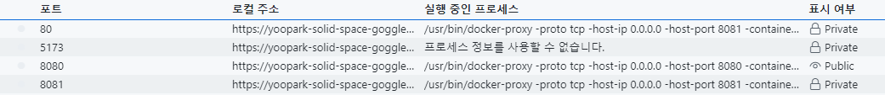

   > Codespace에서 `AI/requiements.txt`를 설치할 때, torch의 용량이 너무 커서 에러를 발생시키는 경우가 있습니다.   
   그럴 때는 requirements.txt에서 `torch==1.12.1`을 주석처리하시고 r12n2.py의 `try~catch` 구문과 예외 처리 부분을 삭제해주십시오.   
   유저가 많아져 기존 학습 정보로만 추천을 할 수 없는 예외적인 상황에서 torch가 실행되므로 평시의 경우 문제없이 빌드하실 수 있습니다.  

   >  HTTP ⇆ HTTPS Mixed Contents 오류가 발생할 경우 : Chrome URL 창 왼쪽의 자물쇠 버튼 → [사이트 설정] → [안전하지 않은 콘텐츠]를 '허용'으로 변경하셔서 임시로 꺼주십시오

5. 테스트 계정 ID : `user1`   
    테스트 계정 PW : `test` 

## ✔️ **Getting Started | 튜토리얼**

<details open="open">
    <summary>Step 1. <b>나만의 계정을 만드세요</b></summary>
   <table align="center">
      <tr>
         <td align="center">
            <b>회원정보 입력하기</b>
         </td>
         <td align="center">
            <b>선호하는 밀리루틴 선택</b>
         </td>
      </tr>
      <tr>
         <td align="center">
            아이디, 비밀번호, 닉네임 등 계정 생성에 필요한 기본 정보를 입력합니다
         </td>
         <td align="center">
            AI의 초기 학습을 위해 관심 카테고리와 선호하는 밀리루틴을 선택합니다.
         </td>
      </tr>
      <tr>
         <td align="center">
            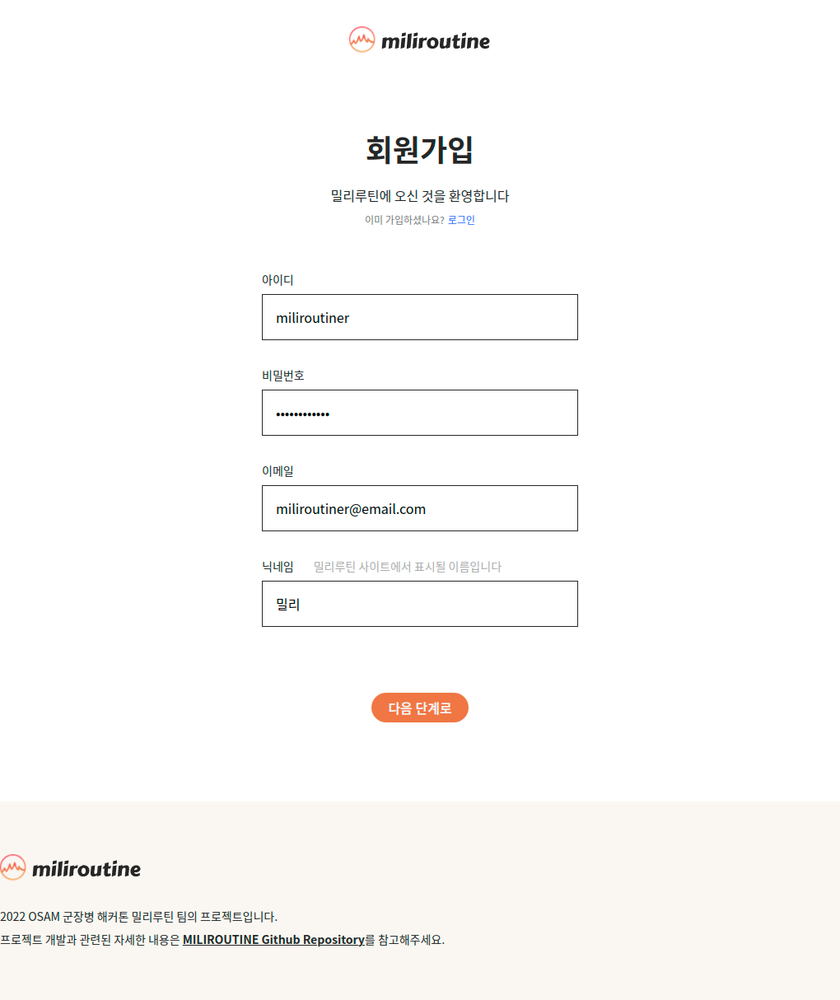
         </td>
         <td align="center">
            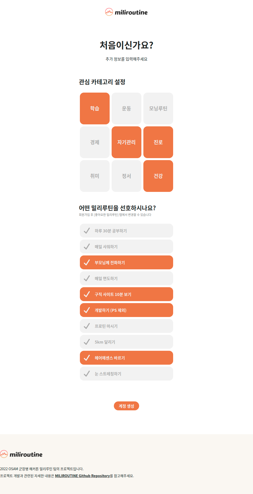
         </td>
      </tr>
   </table>
</details>
<details open="open">
    <summary>Step 2. <b>관심 있는 밀리루틴에 참여하세요</b></summary>
   <table align="center">
      <tr>
         <td align="center">
            <b>메인 페이지(로그인 상태)</b>
         </td>
         <td align="center">
            <b>인기 밀리루틴</b>
         </td>
      </tr>
      <tr>
         <td align="center">
            AI 추천 밀리루틴과 인기 밀리루틴을 요약해서 보여줍니다.
         </td>
         <td align="center">
            참여자 순으로 정렬된 인기 밀리루틴을 통해 다른 유저들이 선호하는 루틴을 알 수 있습니다.
         </td>
      </tr>
      <tr>
         <td align="center">
            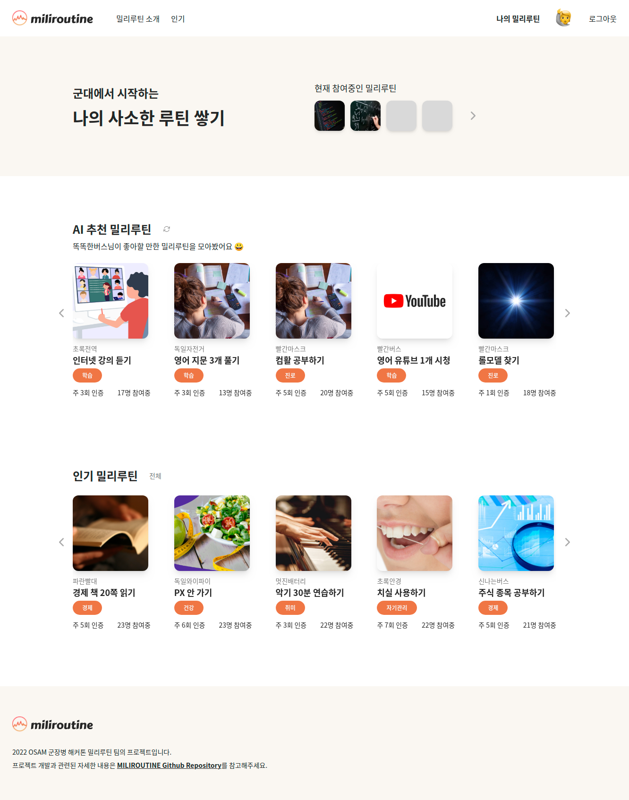
         </td>
         <td align="center">
            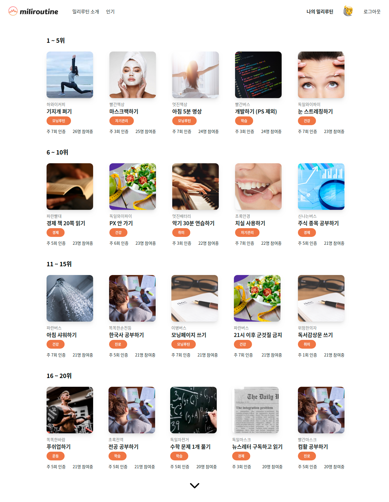
         </td>
      </tr>
   </table>
   <table align="center">
      <tr>
         <td align="center">
            <b>밀리루틴 상세 페이지</b>
         </td>
         <td align="center">
            <b>밀리루틴 개설하기</b>
         </td>
      </tr>  
      <tr>
         <td align="center">
            관심있는 밀리루틴을 클릭하면 상세 정보를 확인하고 참여 신청할 수 있습니다.
         </td>
         <td align="center">
            [나의 밀리루틴] - [밀리루틴 개설하기] 탭에서 밀리루틴을 직접 개설할 수 있습니다.
         </td>
      </tr>
      <tr>
         <td align="center">
            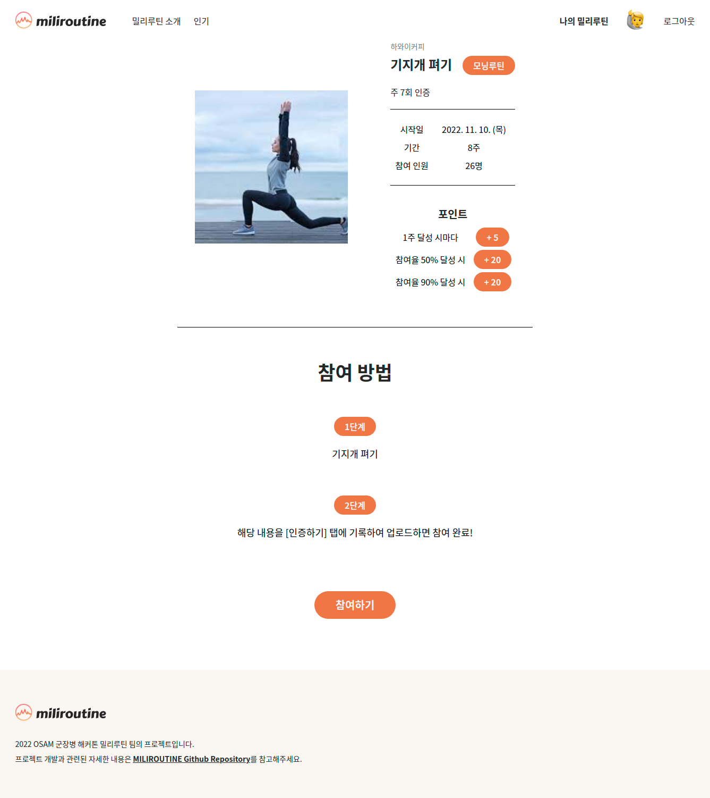
         </td>
         <td align="center">
            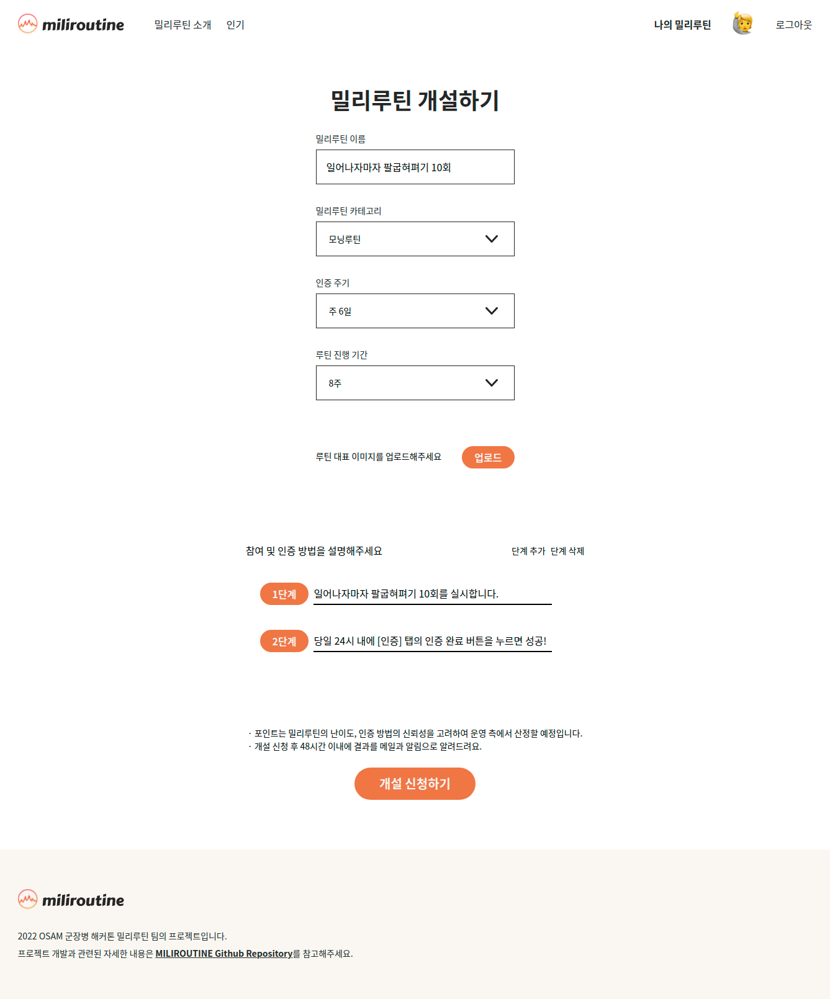
         </td>
      </tr>
   </table>
</details>
<details open="open">
    <summary>Step 3. <b>꾸준히 밀리루틴을 지키고 인증하세요</b></summary>
   <table align="center">
      <tr>
         <td align="center">
            <b>나의 밀리루틴 페이지</b>
         </td>
         <td align="center">
            <b>인증 페이지</b>
         </td>
      </tr>
      <tr>
         <td align="center">
            참여중인 밀리루틴, 좋아요한 밀리루틴 등을 모아서 보여줍니다. <br>시작일이 지난 루틴의 경우 루틴 참여율을 볼 수 있습니다.
         </td>
         <td align="center">
            [나의 밀리루틴] - [인증하기]에서 이미지와 글을 업로드하여 루틴 수행을 인증합니다. <br>인증 시 사용했던 이미지와 글을 다시볼 수 있습니다.
         </td>
      </tr>
      <tr>
         <td align="center">
            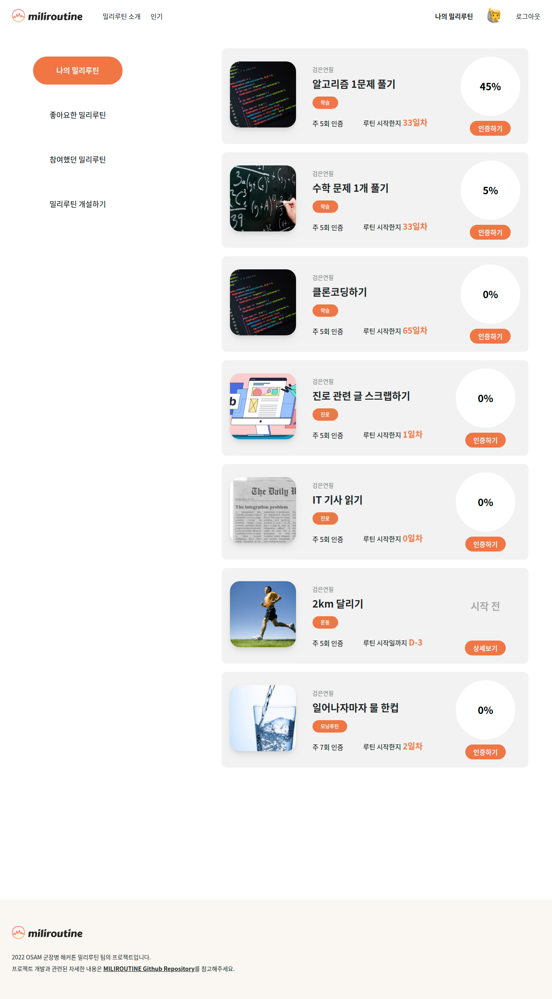
         </td>
         <td align="center">
            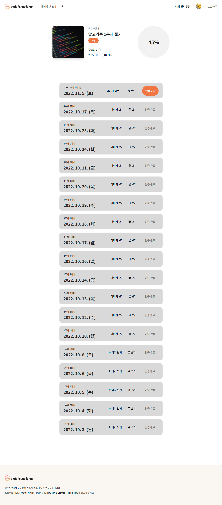
         </td>
      </tr>
   </table>
   <table align="center">
      <tr>
         <td align="center">
            <b>포인트샵 페이지</b>
         </td>
         <td align="center">
            <b>설정 페이지</b>
         </td>
      </tr>
      <tr>
         <td align="center">
            루틴 참여율에 따라 경험치와 포인트를 얻을 수 있습니다. <br>[프로필 사진 클릭] - [포인트샵]에서 원하는 상품을 구매해보세요.
         </td>
         <td align="center">
            닉네임, 비밀번호 등 회원정보를 수정할 수 있습니다.
         </td>
      </tr>
      <tr>
         <td align="center">
            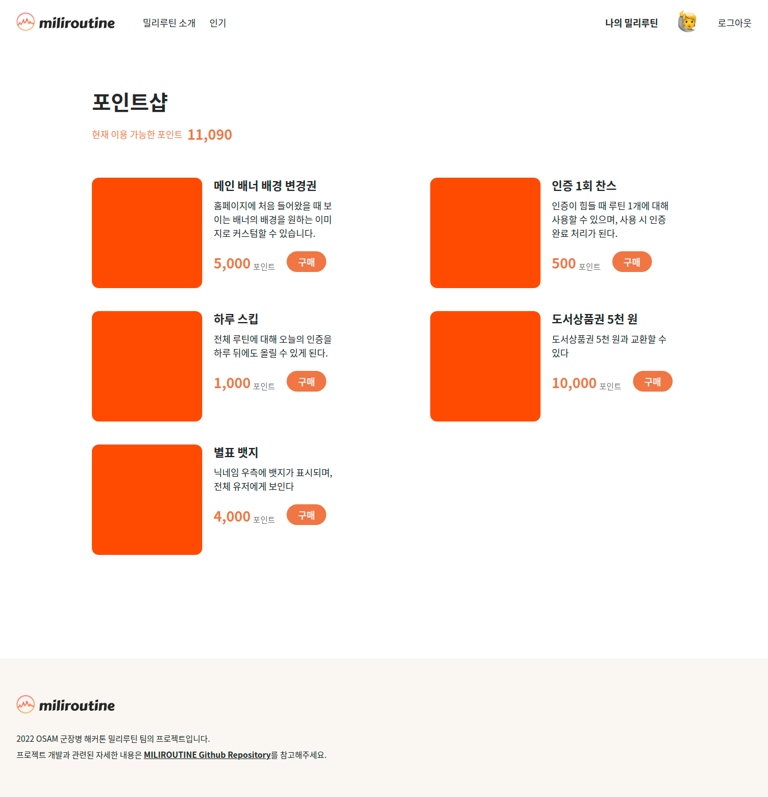
         </td>
         <td align="center">
            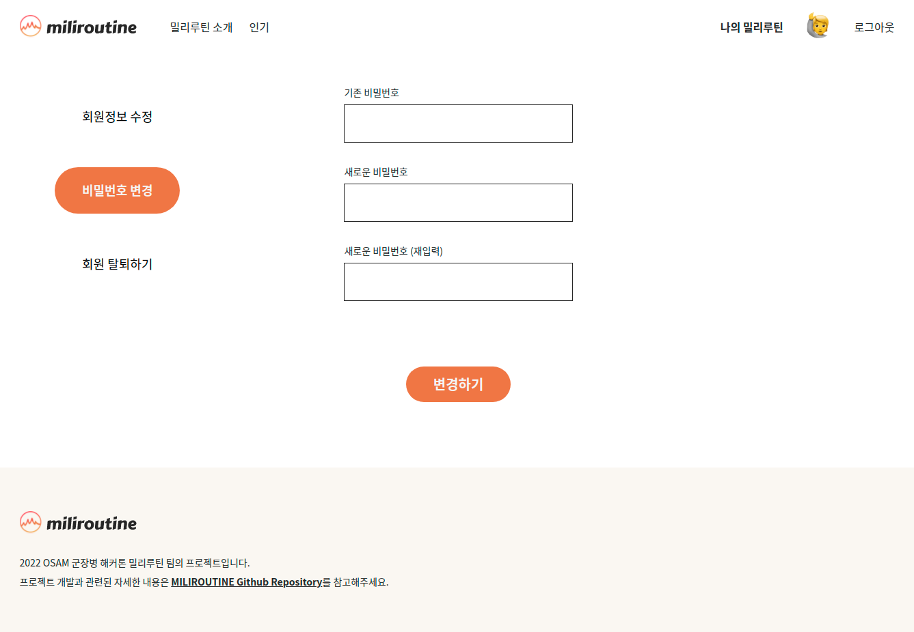
         </td>
      </tr>
   </table>    
</details>

> 더 자세한 내용은 [[밀리루틴 소개] 페이지](http://miliroutine.com/about)를 참고해주십시오.

## 🖥️ **Technique Used | 기술 스택**

### 기획, UI/UX

- `FigJam`
- `Figma`

### Backend

- `Node.js` + `Express`
- `MySQL`

### Frontend

- `React`
- `Typescript`
- `tailwindCSS`

### AI(Machine Learning)

- `Pytorch`

### CI/CD

- `Git`
- `Vite`
- `Docker-compose`

> 세부 개발 스택 및 라우팅/API/DB 관련 사항은 세부 폴더의 `README.md`에서 확인 바랍니다!  
> [프론트엔드 README](<WEB(FE)/README.md>) | [백엔드 README](<WEB(BE)/README.md>) | [AI/ML README](AI/README.md)

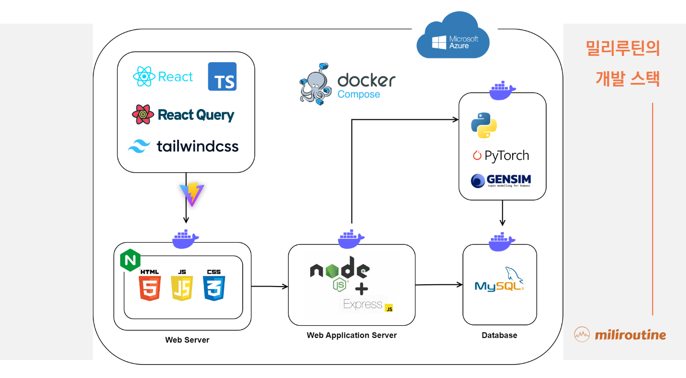

## 👋 **Team Info | 팀 정보**

| 이름   | 역할              | 이메일                | 깃허브 ID                                                                                                                                                                 |
| ------ | ----------------- | --------------------- | ------------------------------------------------------------------------------------------------------------------------------------------------------------------------- |
| 박용준 | 팀장, 기획/디자인 | yongjun0613@naver.com | <a href="https://github.com/yoopark" target="_blank"></a>           |
| 권재원 | Frontend          | springkjw@gmail.com   | <a href="https://github.com/springkjw" target="_blank"></a>       |
| 이시웅 | 디자인, Frontend  | sco3o17@gmail.com     | <a href="https://github.com/silverttthin" target="_blank"></a> |
| 김민찬 | Backend           | cmk0487@naver.com     | <a href="https://github.com/minchan02" target="_blank"></a>       |
| 이동현 | AI/ML             | dong97338@gmail.com   | <a href="https://github.com/dong97338" target="_blank"></a>       |

- 소스코드 버전 관리 : `Github`
- 커뮤니케이션 : `Slack`
- 문서, 회의록 관리 : `Notion`

## 📃 **License | 저작권 및 사용권**

- MIT License

> 💡 권한 등 세부적인 내용은 [`LICENSE.md`](https://github.com/osamhack2022/WEB_AI_MILIROUTINE_MILIROUTINE/blob/main/LICENSE.md)에서 확인 바랍니다!

## **기타 강조하고 싶은 사항**

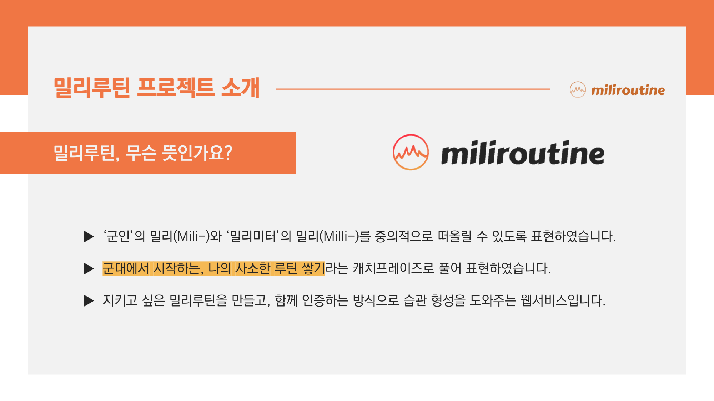
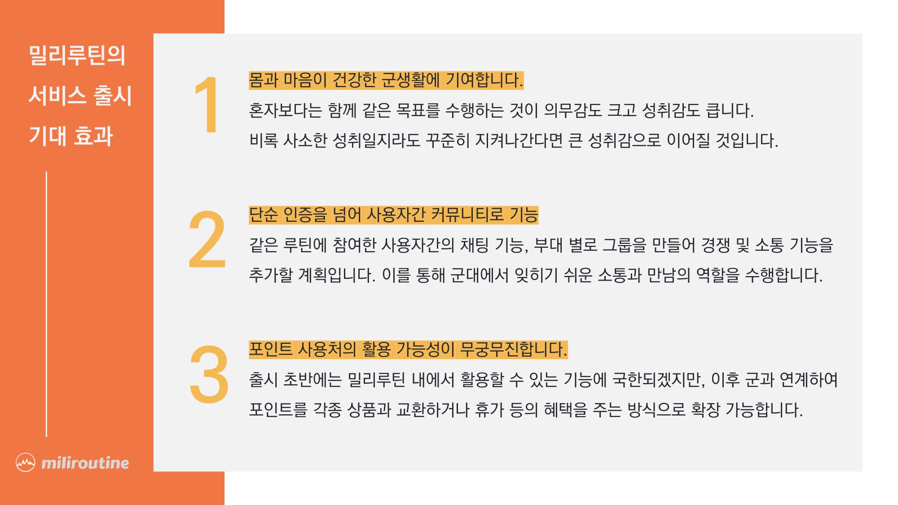